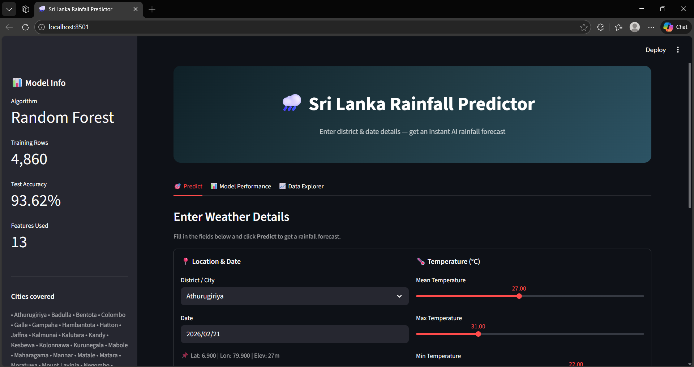
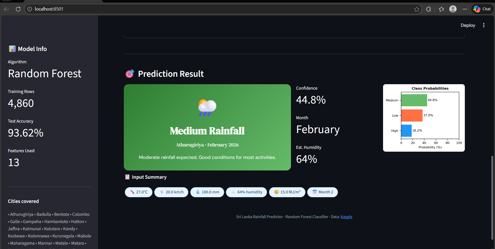

# Sri Lanka Rainfall Predictor

A Streamlit web app that predicts monthly rainfall class (Low / Medium / High) for districts in Sri Lanka using a **Random Forest** classifier trained on historical weather data.




---

## Features

- **Rainfall prediction** — Enter district, date, and weather inputs to get an instant forecast (Low &lt; 60 mm/month, Medium 60–160 mm, High &gt; 160 mm).
- **Model performance** — View accuracy, classification report, and confusion matrix.
- **Data explorer** — Browse and visualize the Sri Lanka weather dataset (districts, time range, rainfall, temperature).

---

## Requirements

- **Python** 3.8+
- **Dataset**: `data/sri-lanka-weather-dataset.csv` (place the CSV in a `data/` folder next to `app.py`)

---

## Setup

1. **Clone or download** this project.

2. **Create a virtual environment** (recommended):
   ```bash
   python -m venv venv
   venv\Scripts\activate
   ```

3. **Install dependencies**:
   ```bash
   pip install streamlit scikit-learn pandas numpy matplotlib
   ```

4. **Ensure the dataset is in place**:
   - Path: `data/sri-lanka-weather-dataset.csv`
   - The CSV should contain columns such as: `time`, `city`, `temperature_2m_mean`, `precipitation_sum`, `windspeed_10m_max`, `shortwave_radiation_sum`, `et0_fao_evapotranspiration`, `winddirection_10m_dominant`, `weathercode`, `latitude`, `longitude`, `elevation`, etc.

---

## Run the app

```bash
streamlit run app.py
```

The app will open in your browser. The first run may take ~30 seconds while the dataset is loaded and the model is trained.

---

## Project structure

```
SLRainfall Detect/
├── app.py                          # Streamlit app & model training
├── data/
│   └── sri-lanka-weather-dataset.csv
├── home.png                        # App screenshot
└── README.md
```

---

## Model details

| Item        | Description |
|------------|-------------|
| **Algorithm** | Random Forest Classifier |
| **Target**    | Rainfall class: Low / Medium / High |
| **Features**  | District, month, temperature (mean/max/min), wind speed & direction, monthly rainfall, rain days, radiation, evapotranspiration, latitude, longitude, elevation, humidity |
| **Train/Test**| 80/20 split, stratified |

---

## License

Use and modify as needed for your project.
